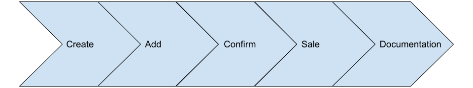

# Introduction to the purchase process

The purchase process basically consists of 5 steps:

1. [Create the shopping cart.](./create.md)
2. [Add the desired product(s) to the cart.](./add.md)
3. [Reserve the prices of the products in the cart.](./confirm.md)
4. [Confirm the cart.](./sale.md)
5. [Obtain the documentation.](./documentation.md)

## Purchase process flow

In addition to the 5 steps/methods listed above, there are other methods that allow us to modify elements of the process.

## Other elements of the purchase process

These methods allow us to:

- [Remove a product from the cart.](./remove.md)
- [Cancel a reservation.](./cancelConfirm.md)
