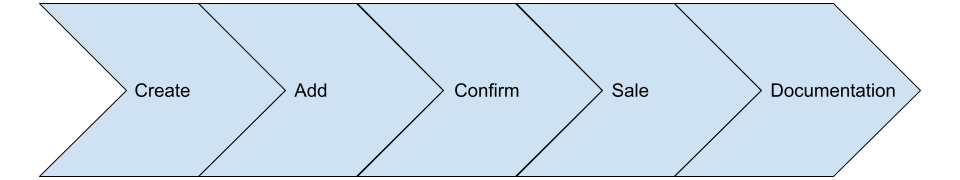

# Introducción al proceso de compra

El proceso de compra consta de, básicamente, 5 pasos:

1. [Creación del carrito de la compra.](./create.md)
2. Adición del/los producto/s deseados al carrito.
3. Reserva de los precios de los productos del carrito.
4. Confirmación del carrito.
5. Obtención de la documentación.

## Flujo del proceso de compra

Además de los 5 pasos/métodos listados anteriormente, existen otros métodos que nos permitirán modificar elementos del proceso.

## Otros elementos del proceso de compra

Estos métodos nos van a permitir:

- Eliminar un producto del carrito.
- Cancelar una reserva.